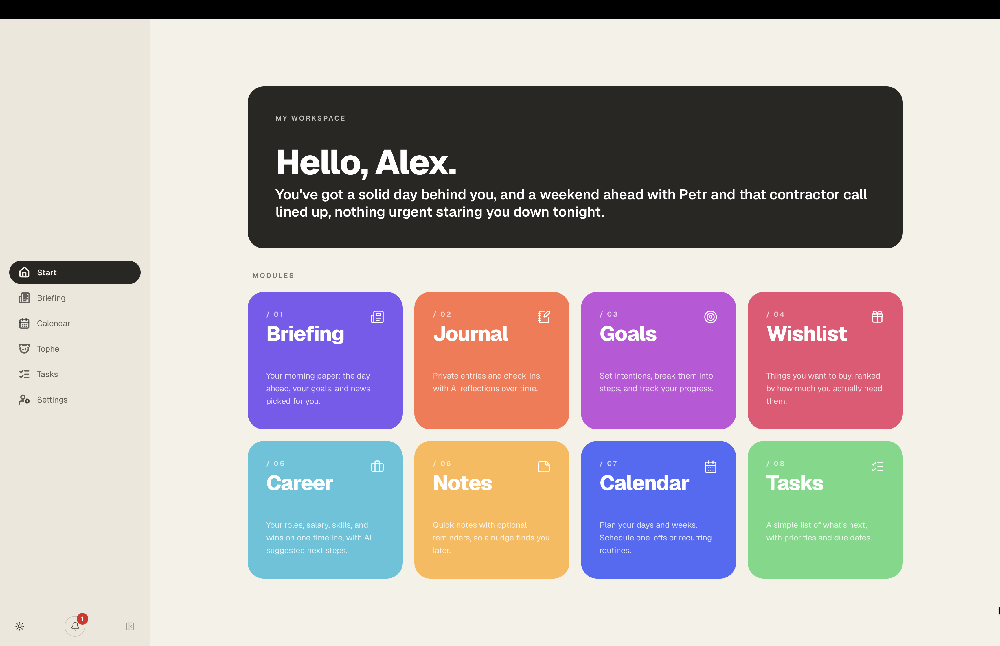

<p align="center">
  <picture>
    <source media="(prefers-color-scheme: dark)" srcset="branding/tophe_branding_readme.svg">
    
  </picture>
</p>

A personal life tracker with optional AI: journal, goals, tasks, notes, calendar,
career tracking, a wishlist, a daily news briefing, and a renameable AI assistant
that reads across all of it.



## Local Install (one command)

For local use you need [Docker Desktop](https://www.docker.com/products/docker-desktop/)
(free). Then, in a terminal (on Windows: inside WSL, which Docker Desktop
sets up for you):

```bash
curl -fsSL https://raw.githubusercontent.com/TomFrodyma/tophe/main/install.sh | sh
```

The installer sets everything up: it generates the security keys, asks where
the AI should run (on your computer for full privacy, or in the cloud via
Claude, OpenAI, or any compatible provider), builds the app, and opens it in
your browser. The app then walks you
through creating your account.

Going fully local? [Set up Ollama](#local-models-with-ollama) first — it takes
two minutes.

Run `./install.sh` again any time to update or change the AI setup. Your data
and settings are kept.

## Cloud install (one click)

Prefer it hosted? Deploy the whole stack (app, Postgres, cron) to Railway, paired
with a hosted LLM provider like Anthropic:

[](https://railway.com/deploy/-25itW?referralCode=ODA8ca&utm_medium=integration&utm_source=template&utm_campaign=generic)

The template deploys without an AI key: add your provider's API key (for example
`ANTHROPIC_API_KEY`) to the app service's variables to turn the AI features on.

## Stack

Next.js (App Router) monorepo with oRPC, Prisma + Postgres, Better Auth, and a
pluggable AI layer (self-hosted local models, the Claude API, and/or any
OpenAI-compatible hosted provider).

```
apps/web          the app
packages/*         api (oRPC), database (Prisma), auth, ai, ui, mail, storage, i18n, …
```

## Development setup (advanced)

To build on this app, run it on the host with just the backing services
in Docker:

```bash
pnpm install
docker compose up -d postgres minio    # backing services only
cp .env.example .env.local             # then fill in the generated secrets
pnpm --filter @repo/database push
pnpm dev
```

Open the app and it asks you to create your account (first run only). If you
prefer the CLI: `pnpm --filter @repo/scripts create:user`.

See `AGENTS.md` for architecture and conventions, and `SECURITY.md` for the
security model. Deployment notes (Railway, Prisma SSL, the storage volume, the
cron jobs) are documented in `AGENTS.md`.

The AI assistant's persona and "what it knows about you" ship as neutral
placeholder defaults. Your real profile lives in Settings (stored in the
database, never in source).

## AI models, local first

This app holds a lot of personal data; that's the whole point of it. You choose
where the AI runs, and **the recommended setup is a fully local one**: host the
app on your own hardware and point it at a self-hosted model, so nothing ever
leaves your network.

Configure any mix of providers via env. The chat's model picker offers
whatever you configure:

```bash
# Self-hosted, via Ollama, LM Studio, llama.cpp, or vLLM (they all speak the same standard API)
LOCAL_AI_BASE_URL="http://localhost:11434/v1"

# And/or the Claude API
ANTHROPIC_API_KEY="sk-ant-..."

# And/or OpenAI - or any other hosted OpenAI-compatible provider
OPENAI_API_KEY="sk-..."
# OPENAI_BASE_URL="https://openrouter.ai/api/v1"   # only when it's not OpenAI itself
```

**No AI configured yet?** The installer asks this during setup, but if you
skipped it — or deployed with the Railway button, which ships without a key —
the assistant, briefing, and greeting stay off until you set one of the
variables above (in `.env` for the script install, or on the Railway service
under Variables) and restart.

Every model installed on the local server is discovered automatically and shows
up in the chat's model picker. To curate the list or give models nicer names,
set the optional `LOCAL_AI_MODELS="llama3.3=Llama 3.3,qwen2.5:32b=Qwen 2.5 32B"`.

Any of the servers above works out of the box. The model can be
on the same machine, an old PC on your LAN, or a box reached over Tailscale.
Everything stays between the app and that server; no third party is involved.
Never expose a model server (Ollama has no auth) directly to the internet. The
chat's tool use and the structured briefing work best with tool-capable models
(Llama 3.3, Qwen 2.5 32B+, or similar); small models may struggle. See the env
table in `AGENTS.md` for the default-model and background-task knobs.

**Prefer *instruct* variants over *thinking* variants for chat.** Reasoning
models (tags like `-thinking`, or DeepSeek-R1) spend hundreds to thousands of
hidden tokens deliberating before every reply. On local hardware that's often
minutes per message, and it happens again after every tool call. The chat shows
a "Thinking…" chip while they deliberate, but an instruct model answers in
seconds and is the right default.

### Local models with Ollama

[Ollama](https://ollama.com) is the easiest local model server: no account,
no key.

**macOS**

```bash
brew install ollama        # once; the server starts on login
ollama pull qwen2.5:32b    # ~20 GB download, a good fit for 32-48 GB machines
```

No Homebrew? Download the app from
[ollama.com/download/mac](https://ollama.com/download/mac) instead.

**Windows**

1. Download and run the installer from
   [ollama.com/download/windows](https://ollama.com/download/windows).
   Ollama lives in the system tray and starts with Windows.
2. In PowerShell: `ollama pull qwen2.5:32b`

On a 16 GB machine (either OS), pull `qwen2.5:14b` instead of the 32B model.

Then re-run `./install.sh` and pick "on this computer": it points the app at
your models (inside Docker that address is `host.docker.internal`, which the
installer handles for you). Every model you `ollama pull` appears in the
chat's model picker. Only if you run the app outside Docker do you set the
`LOCAL_AI_BASE_URL` line above yourself.

Two performance notes for local chat: the first message after a while is the
slow one (the model reloads into memory and ingests the agent's full prompt,
~10s); follow-ups reuse the server's cache and answer in a second or two. To
keep the model in memory between chats, raise Ollama's default 5-minute unload:

```bash
launchctl setenv OLLAMA_KEEP_ALIVE 2h   # macOS, then restart Ollama
```

```powershell
setx OLLAMA_KEEP_ALIVE 2h   # Windows, then quit and reopen Ollama from the tray
```

## License

MIT, see [LICENSE](./LICENSE).

Huge thanks to [supastarter](https://supastarter.dev). This app was built on supastarter and open-sourced with their permission.